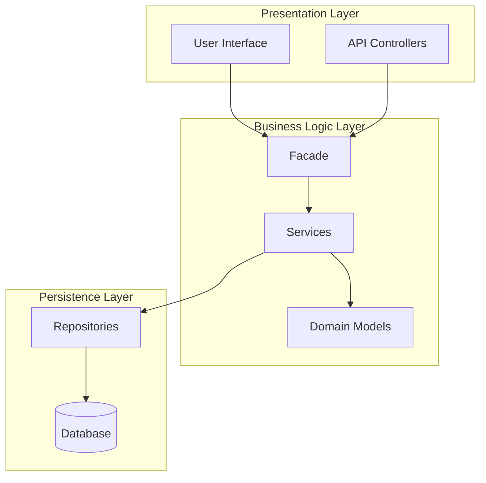

```mermaid
flowchart TB

    subgraph Presentation Layer
        UI[User Interface]
        API[API Controllers]
    end

    subgraph Business Logic Layer
        FACADE[Facade]
        SERVICES[Services]
        MODELS[Domain Models]
    end

    subgraph Persistence Layer
        REPO[Repositories]
        DB[(Database)]
    end

    UI --> FACADE
    API --> FACADE

    FACADE --> SERVICES
    SERVICES --> MODELS

    SERVICES --> REPO
    REPO --> DB
```
