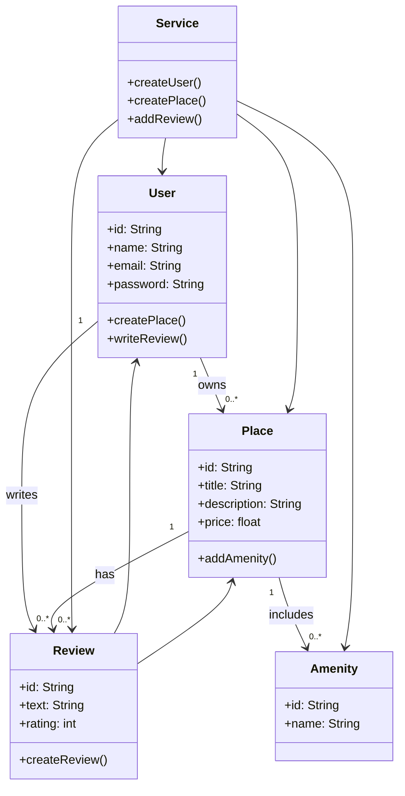

```mermaid
classDiagram

class User {
  +id: String
  +name: String
  +email: String
  +password: String
  +createPlace()
  +writeReview()
}

class Place {
  +id: String
  +title: String
  +description: String
  +price: float
  +addAmenity()
}

class Review {
  +id: String
  +text: String
  +rating: int
  +createReview()
}

class Amenity {
  +id: String
  +name: String
}

class Service {
  +createUser()
  +createPlace()
  +addReview()
}

%% RELATIONSHIPS

User "1" --> "0..*" Place : owns
User "1" --> "0..*" Review : writes

Place "1" --> "0..*" Review : has
Place "1" --> "0..*" Amenity : includes

Review --> User
Review --> Place

Service --> User
Service --> Place
Service --> Review
Service --> Amenity
```
