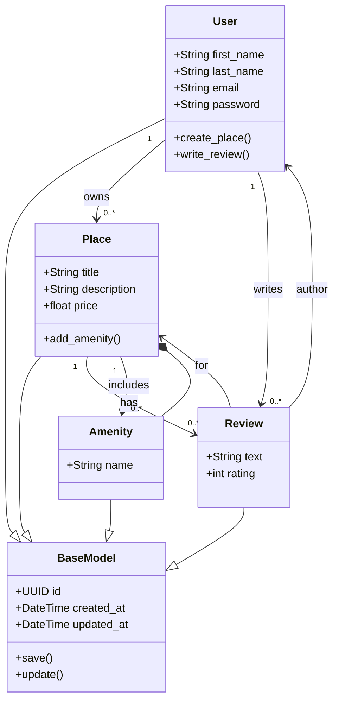

```mermaid
classDiagram

class BaseModel {
  +UUID id
  +DateTime created_at
  +DateTime updated_at
  +save()
  +update()
}

class User {
  +String first_name
  +String last_name
  +String email
  +String password
  +create_place()
  +write_review()
}

class Place {
  +String title
  +String description
  +float price
  +add_amenity()
}

class Review {
  +String text
  +int rating
}

class Amenity {
  +String name
}

%% INHERITANCE
User --|> BaseModel
Place --|> BaseModel
Review --|> BaseModel
Amenity --|> BaseModel

%% RELATIONSHIPS
User "1" --> "0..*" Place : owns
User "1" --> "0..*" Review : writes

Place "1" --> "0..*" Review : has
Place "1" --> "0..*" Amenity : includes

Review --> User : author
Review --> Place : for

%% COMPOSITION
Place *-- Amenity
```
