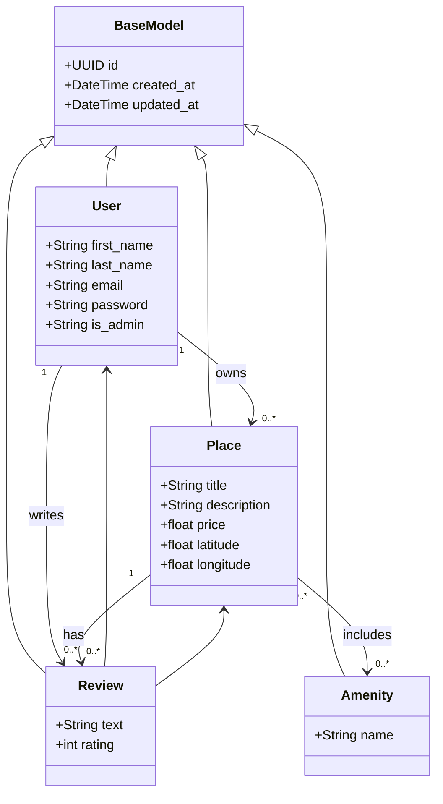

```mermaid
classDiagram

%% =====================
%% BASE MODEL
%% =====================
class BaseModel {
  +UUID id
  +DateTime created_at
  +DateTime updated_at
}

%% =====================
%% USER
%% =====================
class User {
  +String first_name
  +String last_name
  +String email
  +String password
  +String is_admin
}

%% =====================
%% PLACE
%% =====================
class Place {
  +String title
  +String description
  +float price
  +float latitude
  +float longitude
}

%% =====================
%% REVIEW
%% =====================
class Review {
  +String text
  +int rating
}

%% =====================
%% AMENITY
%% =====================
class Amenity {
  +String name
}

%% =====================
%% INHERITANCE
%% =====================
BaseModel <|-- User
BaseModel <|-- Place
BaseModel <|-- Review
BaseModel <|-- Amenity

%% =====================
%% RELATIONSHIPS
%% =====================

User "1" --> "0..*" Place : owns
User "1" --> "0..*" Review : writes

Place "1" --> "0..*" Review : has
Place "0..*" --> "0..*" Amenity : includes

Review --> User
Review --> Place
```
