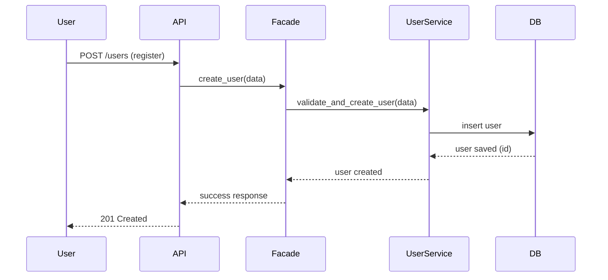
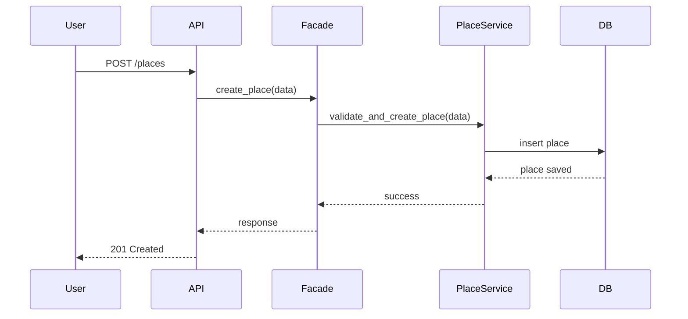
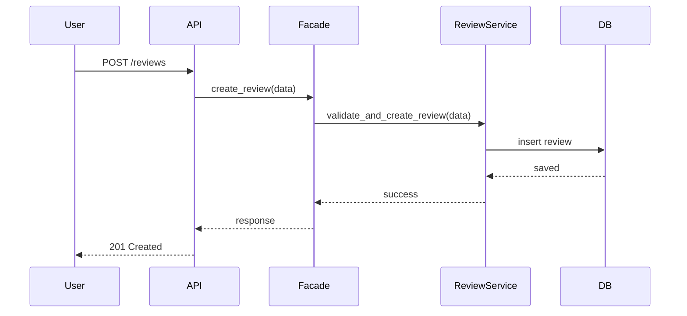
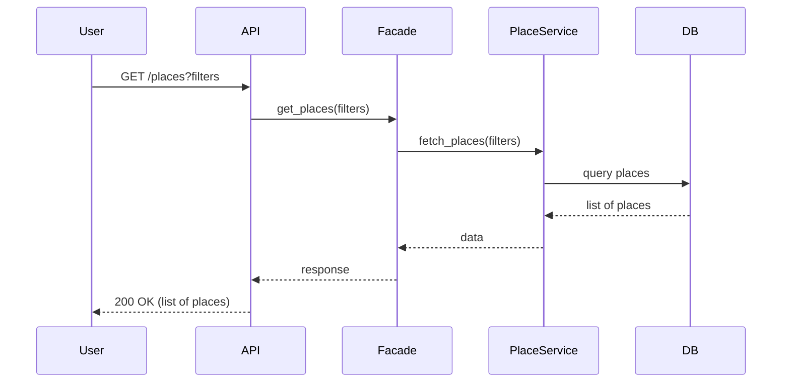

## Explanation

### 1. User Registration
User sends registration data → system validates → user stored in database → success response returned.

### 2. Place Creation
Authenticated user creates a place → service validates data → place saved in database.

### 3. Review Submission
User submits review for a place → review service validates and stores it.

### 4. Fetch Places
User requests list of places → system queries database → returns filtered results.

---

## Flow Summary

All requests follow the same architecture:

User → API → Facade → Service → Database → Response
