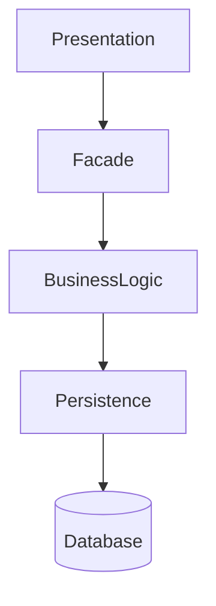
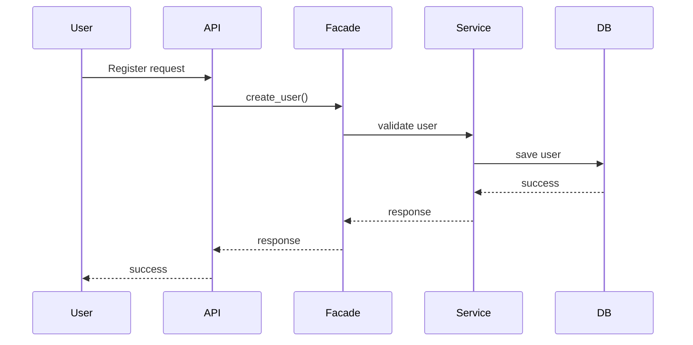
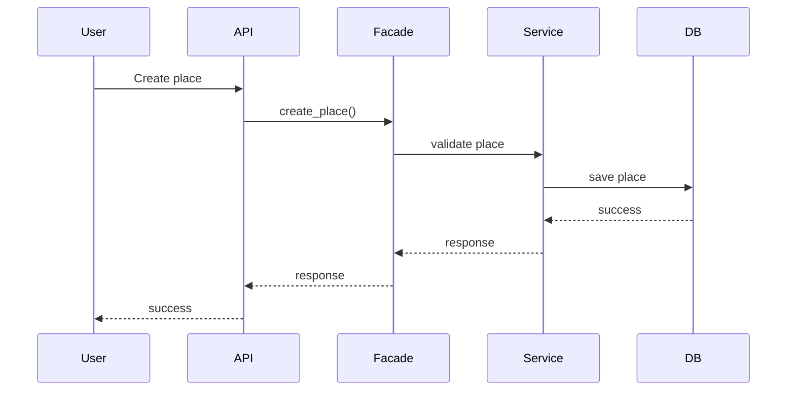
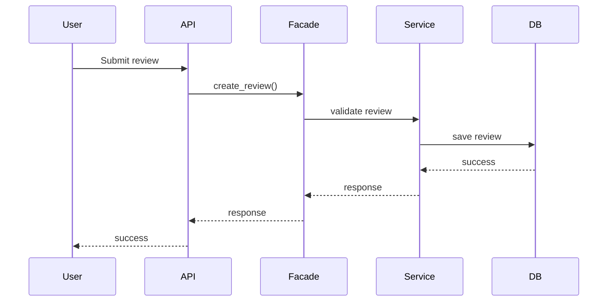
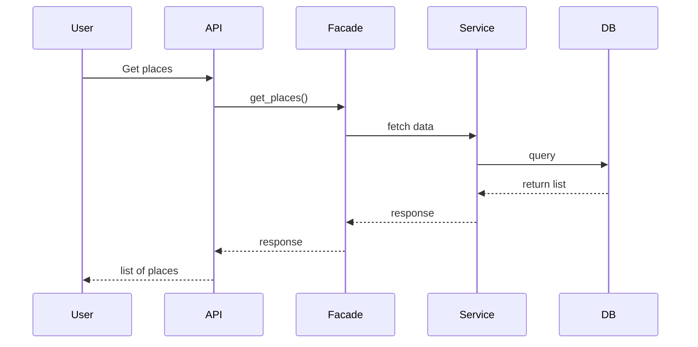

# HBnB - Technical Documentation

---

## 1. Introduction

This document presents the overall design of the HBnB application.  
It serves as a technical blueprint for the system architecture, business logic, and API interactions.

The goal of this document is to provide a clear understanding of how the system is structured and how different components interact with each other during execution.

The system follows a **layered architecture** and uses the **Facade design pattern** to simplify communication between layers.

---

## 2. High-Level Architecture

### Overview

The system is divided into three main layers:

- Presentation Layer (API / Controllers)
- Business Logic Layer (Services)
- Persistence Layer (Database / Repositories)

A Facade is used to provide a single entry point between layers.

---

### Diagram

---

### Explanation

- **Presentation Layer** handles user requests and API calls.
- **Facade** acts as a bridge between layers.
- **Business Logic Layer** processes all application rules.
- **Persistence Layer** manages database operations.

This design ensures:
- Separation of concerns
- Easier maintenance
- Reduced coupling between components

---

## 3. Business Logic Layer

### Overview

This layer contains the core entities of the system:
- User
- Place
- Review
- Amenity

All entities inherit from a BaseModel that provides common attributes.

---

### Diagram

(Insert your Task 2 diagram here)

---

### Explanation

- **User**: Represents system users who can create places and write reviews.
- **Place**: Represents property listings in the system.
- **Review**: Represents feedback left by users.
- **Amenity**: Represents features of a place (WiFi, Pool, etc.).
- **BaseModel**: Provides UUID, created_at, updated_at.

Relationships:
- A user can create multiple places.
- A user can write multiple reviews.
- A place can have multiple reviews.
- A place can include multiple amenities.

---

## 4. API Interaction Flow

### Overview

This section describes how API requests flow through the system layers.

---

### 4.1 User Registration

---

### 4.2 Place Creation

---

### 4.3 Review Submission

---

### 4.4 Fetch Places

---

## 5. Conclusion

The HBnB system is designed using a layered architecture with clear separation of concerns.

Key benefits:
- Scalability
- Maintainability
- Clean architecture
- Easy extension of features

The Facade pattern simplifies communication between layers and ensures that the system remains modular and easy to understand.
